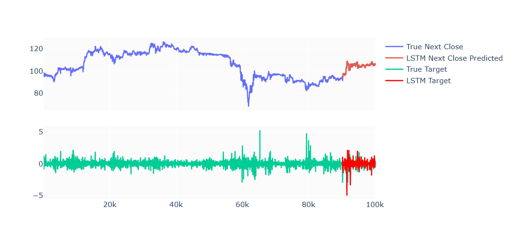
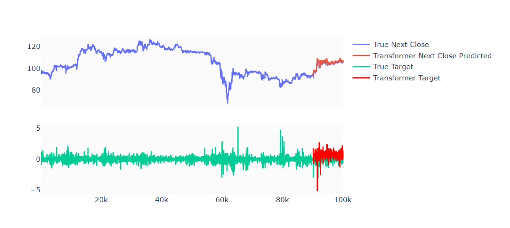

# Stock Fluctuation Prediction With LSTM and Transformer

# 🌟 Introduction

This project will use the Encoder Architectures to make predictions in stock fluctuations. The dataset is about the stock of FPT, MSN, PNJ, VIC (Vietnamese Stock Market). 
The content includes the following sections:
- EDA
- Data Preprocessing
- Modeling and Training with LSTM, Transformer
- Testing

📑 Data Source: [Finpros](https://finpros.vn/)

# 👀 References

- [Analytics Vidhya. (2021, December 1). Stock Price Prediction using LSTM](https://www.analyticsvidhya.com/blog/2021/12/stock-price-prediction-using-lstm/)
- [Frank, M. (2021, October 19). Stock Price Prediction using Transformers. Medium.](https://medium.com/@Matthew_Frank/stock-price-prediction-using-transformers-2d84341ff213)
- [Tensorflow - LSTM doc](https://www.tensorflow.org/api_docs/python/tf/keras/layers/LSTM)
- [Pytorch - Transformer doc](https://pytorch.org/docs/stable/generated/torch.nn.TransformerEncoder.html)

  
> **For contact:**
> - Email: trongvo250403@gmail.com
> - Linkedin: https://www.linkedin.com/in/vo-hoai-trong-39942630b/
